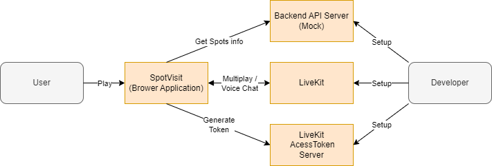
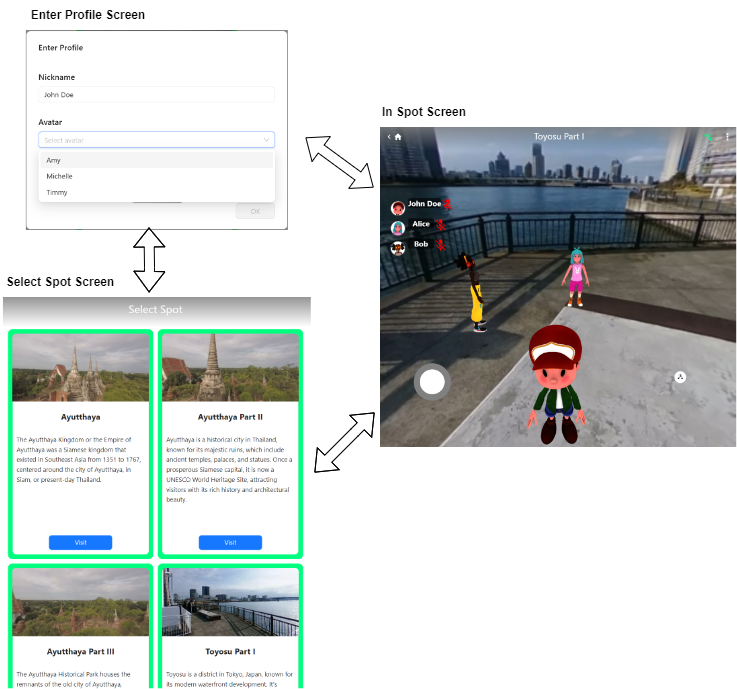

# Architecture

このページでは、SpotVisit のアーキテクチャを示します。

## System Structure

システム構成は次の図の通りです。

- ユーザーは SpotVisit を利用します
- SpotVisit は、Backend API サーバーからスポット情報の一覧を取得します。
- SpotVisit は、LiveKit Access Token サーバーから LiveKit アクセス用のトークンを取得します
- SpotVisit は、マルチプレイとボイスチャットを LiveKit を利用して実行します。



## Screen List & Transition

画面一覧とその遷移は次の図の通りです。

- プロフィール入力画面（ダイアログ）でプレイヤーのニックネームとアバターを選択します
  - 初回起動時は、プロフィール入力画面は強制的に表示されます
- スポット選択画面で訪問したいスポットを選択します
- スポット画面では 360 度動画/画像を表示したりマルチプレイ・ボイスチャットを楽しみます



## Code/Component Structure

ソースコード・コンポーネントのディレクトリ構成は次のようになります。

```
├─components              ... コンポーネントを格納する
│  ├─basics                 ... 再利用可能な基本となるコンポーネント群
│  │  └─ <各コンポーネント>     ... コンポーネントごとにディレクトリを作りその下にtsx/cssを配置する
│  └─pages                  ... ページ単位（basicの組み合わせ）
├─generated               ... バックエンドのAPIの自動生成コード
├─hooks                   ... カスタムReactフック
└─libs                    ... ユーティリティ群
```
