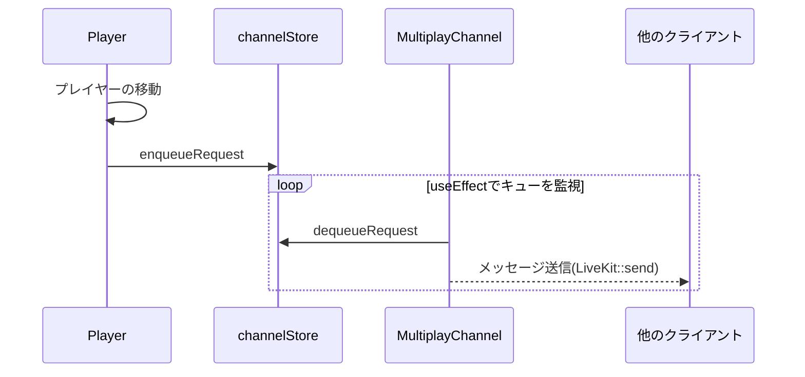
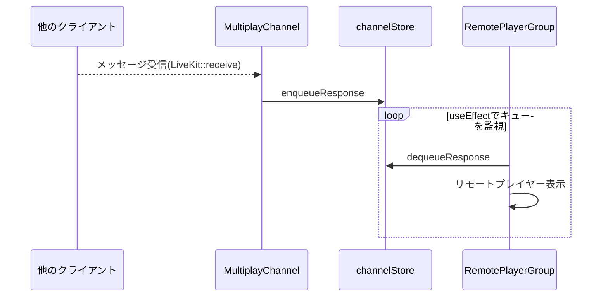

# Development Guide

このページでは、サンプルアプリの全体の構成から個別の機能の開発方針までを説明します。

## ディレクトリ構造

プロジェクト全体のディレクトリやコンポーネントの構成は以下のようになります。

- コンポーネントは、components の下に作成し、basics(単体部品)と pages(画面を表す)で構成します。
- 共通フックは、hooks の下に作成します。個別のコンポーネント専用のフックはコンポーネントと同じ場所に作成します。

```
├─components              ... コンポーネントを格納する
│  ├─basics                 ... 再利用可能な基本となるコンポーネント群
│  │  ├─Avatar                ... アバター
│  │  ├─AvatarSelect          ... アバター選択
│  │  ├─IconMenu              ... アイコンメニュー
│  │  ├─ImageSphere           ... 360度画像の球体表示
│  │  ├─Multiplay             ... マルチプレイ用コンポーネント
│  │  ├─Player                ... プレイヤー（自分）
│  │  ├─RemotePlayer          ... リモートプレイヤー
│  │  ├─RemotePlayerGroup     ... リモートプレイヤーグループ
│  │  ├─ThirdPersonCamera     ... 3人称カメラ
│  │  ├─VideoSphere           ... 360度動画再生コンポーネント
│  │  ├─VirtualJoyStick       ... 仮想JoyStick
│  │  └─VoiceChatPanel        ... ボイスチャット用コンポーネント
│  └─pages                  ... ページ単位（basicの組み合わせ）
│      ├─AvatarSelect         ... アバター選択
│      ├─ErrorPage            ... エラーページ
│      ├─InSpot               ... スポット訪問画面
│      └─SpotSelect           ... スポット選択画面
├─generated               ... バックエンドのAPIの自動生成コード
├─hooks                   ... カスタムReactフック
└─libs                    ... ユーティリティ群
```

## 状態管理

コンポーネントの状態を管理するのに、通常の React の Context と State 以外に、[Zustand](https://github.com/pmndrs/zustand) という状態管理ライブラリを使って複数のコンポーネントにまたがる状態を管理しています。
Zustand では、状態と状態変更関数をセットで管理でき、内部の状態をカプセル化することができます。

次のように使い分けています。

- コンポーネント内の制御に使う状態（ミュート状態など）：State
- 機能をまたがる状態（アバター選択状態など）：Zustand
- バックエンドのデータ状態（スポット情報など）：TanStack Query
- React の Context は使いません。代わりに Zustand を使っています

## ステレオタイプと命名規則

ステレオタイプとは、ファイルの典型的な種類を表します。

- **コンポーネント**：画面表示する部品を指します。
- **フック**：React のカスタムフック関数を指します。
- **ストア**：コンポーネント間を超えて管理する Zustand の状態を指します。

ファイル名のステレオタイプごとの命名規則は次の表となります。

| ステレオタイプ | ファイル名の命名規則                             | 例                      |
| -------------- | ------------------------------------------------ | ----------------------- |
| コンポーネント | 大文字から始まるキャメルケース+.tsx              | SpotCard.tsx            |
| フック         | use ＋大文字から始まるキャメルケース+.ts         | usePlayerInput.ts       |
| ストア         | use ＋大文字から始まるキャメルケース+Store.ts    | useAvatarSelectStore.ts |
| CSS            | CSS modules を使うため、\*.module.css となります | SpotCard.module.css     |

## コンポーネントの責務配置

コンポーネントは、以下の 3 種類に分類されます。

1. 通常の React で描画する 2 次元の HTML 要素になるコンポーネント
2. R3F を使って描画する 3 次元のコンポーネント
3. 3 次元と 2 次元の親子構成を持つ複合コンポーネント

1 は通常の React のコンポーネントと同じですので普通の React と同じように開発します。
2 は、R3F の\<Canvas>要素の下にコンポーネントを配置します。
通常では、 2 の下に 1 は配置できませんが、react-three/drei の`<Html>`コンポーネントを使って混在させることができます。それが、3 です。

コンポーネントは極力 1 と 2 が分かれるように構成されるべきですが、R3F 要素と HTML 要素の混在が必要な部分では 3 を使います。

## 画面遷移

このサンプルアプリケーションでは、ルーティングのライブラリは利用していません。

アバターのプロフィール入力状態やスポットの選択状態に応じてコンポーネントを出し分けて対応しています。  
規模の大きなアプリケーションを作る場合は、React Router や App Router などの利用も検討してください。

## 機能の解説

このセクションでは各機能の実装について解説します。

### Avatar の表示とアニメーション表示

`<Avatar>`コンポーネントは、アバターの表示とアニメーションの変更を行います。

```tsx
const playerInput = usePlayerInput();
const defaultAnimationMap: { [name: string]: string } = {
  Idle: "./motions/Happy_Idle.fbx",
  Walking: "./motions/Walking.fbx",
  Running: "./motions/Running.fbx",
  Jump: "./motions/Jumping.fbx",
};
return (
  <Avatar
    avatarPath={"./avatars/amy.vrm"}
    animationMap={defaultAnimationMap}
    controller={playerInput.movement}
  />
);
```

props として以下を渡すことでアバターとアニメーション表示、キー操作を行えます。
アバターは VRM ファイル、モーションは FBX ファイルを使っています。

| props        | 型                           | 説明                                               |
| ------------ | ---------------------------- | -------------------------------------------------- |
| avatarPath   | string                       | アバターの VRM ファイルへのパス                    |
| animationMap | \{ \[name: string]: string } | モーション名と FBX ファイルへのパスのマップ        |
| controller   | CharacterController          | キーの操作や仮想 JoyStick の操作を表すオブジェクト |

### Spot Select とバックエンド API

スポット選択画面では、バックエンドの API を呼び出してその結果をスポット情報の一覧として表示しています。
下記コードの 2 行目の`useSpots()`がバックエンドの API を呼び出しています。
`useSpots()`は、Tanstack Query を使っており、主要な戻り値は、以下の 3 つです。

- `isLoading` ... バックエンド API を呼び出しており、ロード中か否か。呼び出し終了後は false になります。
- `data` ... バックエンド API から取得された正常レスポンス。正常終了した場合のみ取得できます。
- `error` ... バックエンド API から取得されたエラーレスポンス。エラー発生した場合のみ取得できます。

```tsx
const SpotSelectPanel = () => {
  const { isLoading, data, error } = useSpots();
  if (isLoading) {
    return <Spin fullscreen />;
  }
  if (error) {
    return (
      <>
        Failed to get spot info.
        <pre>{error?.message || "Unknow reason."}</pre>
      </>
    );
  }
  if (data) {
    const spots = data.data;
    return (
      <>
        <div className={styles.content}>
          {spots.map((spot) => (
            <SpotCard key={spot.id} spot={spot} />
          ))}
        </div>
      </>
    );
  }
  return <>No spots found</>;
};
```

`useSpots()`の実装は以下の通りで、[Oval](https://orval.dev/overview)を利用した自動生成コード`useGetSpots()`を呼び出しているだけです。

```ts
import { useGetSpots } from "@/generated/spots/spots";

const useSpots = () => {
  return useGetSpots();
};

export default useSpots;
```

Orval を使った自動生成の詳細については、Fintan の記事「[React Query と OpenAPI 定義ファイルからのコード自動生成ツール Orval を使った Web アプリケーション開発](https://fintan.jp/page/4857/)」を参考にすると良いでしょう。

### Image Sphere による 360 度画像の表示

`<ImageSphere>`コンポーネントは、360 度画像を球体に表示します。

```tsx
<ImageSphere imageSourceUrl={<360度画像へのURL>} />
```

`<ImageSphere>`の実装では、`useTexture` で画像の URL からテクスチャをロードし、`<meshBasicMaterial>`にマップしています。

```tsx
const ImageSphere: React.FC<ImageSphereProps> = (props: ImageSphereProps) => {
  const imageTexture = useTexture(props.imageSourceUrl);
  return (
    <>
      {imageTexture && (
        <mesh scale={[100, 100, 100]}>
          <sphereGeometry />
          <meshBasicMaterial side={THREE.BackSide} map={imageTexture} />
        </mesh>
      )}
    </>
  );
};
```

### Video Sphere & Hidden Video による 360 度動画の表示

360 度動画の表示は、ビデオを非表示で再生する`<HiddenVideo>`コンポーネントと、360 度球体で表示する`<VideoSphere>`から構成されます。  
構成が分かれている理由は、球体にビデオを表示するためには、技術的にビデオの再生中のテクスチャを球体にマップする必要があるためです。`<HiddenVideo>`では html 要素の`<video>`タグを利用して見えない動画を再生し、`<VideoSphere>`ではそのテクスチャを球体にマップしています。

利用する際は、次のように実装します。

```tsx
<>
  <Canvas> <!-- R3F のキャンバス -->
    <VideoSphere
      videoId="video"
      radius={100}
    />
  </Canvas>
  <div>
    <HiddenVideo
      videoSourceUrl="<360度動画へのURL>"
      videoId="video"
    />
  </div>
</>
```

`<HiddenVideo>`コンポーネントは、ビデオを html の通常の`<video>`タグを非表示にして再生しています。
以下は、`<HiddenVideo>`のレンダー部分の抜粋です。

```tsx
  return (
    <div>
      <video
        id={props.videoId || "video"}
        ref={videoRef}
        crossOrigin="anonymous"
        width="100"
        height="100"
        playsInline
        autoPlay
        muted
        preload="auto"
        loop
        style={{ opacity: 0, position: "absolute", zIndex: -1 }}
      />
      <div>
        <!-- 再生、停止のアイコンは省略-->
      </div>
    </div>
  );
```

`<VideoSphere>`コンポーネントでは、再生されているビデオのテクスチャを`<meshBasicMaterial>`にマップして行います。
`<VideoSphere>` の実装は以下のようになります。  
THREE.VideoTexture に`<video>`タグの参照を渡してテクスチャをロードし、`<meshBasicMaterial>`にマップしています。

```tsx
const VideoSphere = (props: VideoSphereProps) => {
  const videoId = props.videoId || "video";
  const videoRef = useRef<HTMLVideoElement | null>(null);
  const [videoTexture, setVideoTexture] = useState<THREE.VideoTexture | null>(
    null
  );

  useEffect(() => {
    const videoElements = document.getElementById(videoId) as HTMLVideoElement;
    videoRef.current = videoElements;

    if (videoRef.current) {
      const texture = new THREE.VideoTexture(videoRef.current);
      texture.minFilter = THREE.LinearFilter;
      texture.magFilter = THREE.LinearFilter;

      setVideoTexture(texture);
    }
  }, [props.radius]);

  return (
    <>
      {videoTexture && (
        <mesh
          visible
          position={[0, 0, 0]}
          rotation={[0, 0, 0]}
          scale={[-1, 1, 1]}
        >
          <sphereGeometry
            attach="geometry"
            args={[props.radius || 500, 60, 40]}
          />
          <meshBasicMaterial
            toneMapped={false}
            attach="material"
            color="white"
            side={THREE.BackSide}
            map={videoTexture}
            transparent
          />
        </mesh>
      )}
    </>
  );
};
```

### LiveKit を使ったマルチプレイ

サンプルアプリケーションでのマルチプレイは[LiveKit](https://docs.livekit.io/realtime/)という WebRTC の OSS を利用して実現しています。

マルチプレイの実装は、コンポーネント(`<MultiplayChannel>`)とキューのストア(`useMultiplayChannelStore`)の 2 つの部品から構成されています。
マルチプレイを有効にするためには、次の例のように `<MultiplayChannel>` を使います。

```tsx
<MultiplayChannel
  livekitServerUrl="ws://localhost:7880"
  accessTokenUrl="http://localhost:3001/getToken"
  connect={connect}
  audio={audio}
  roomName={groupName}
  userName={playerId}
  onJoinCallback={onJoinCallback}
  onLeaveCallback={onLeaveCallback}
/>
```

`<MultiplayChannel>` コンポーネントの props は次の表のとおりです。

| プロパティ       | 型       | 説明                                                            |
| ---------------- | -------- | --------------------------------------------------------------- |
| livekitServerUrl | string   | LiveKit のサーバー URL を ws または wss で指定します            |
| accessTokenUrl   | string   | アクセストークンを返す API のエンドポイントを指定します         |
| connect          | boolean  | true になるとマルチプレイ接続を開始し、false になると終了します |
| audio            | boolean  | true の場合、ボイスチャットが可能になります                     |
| roomName         | string   | 接続するルーム名を指定します                                    |
| userName         | string   | 接続するユーザー名を指定します。ユニークである必要があります    |
| onJoinCallback   | function | マルチプレイ接続時に呼び出されるコールバック関数を指定します    |
| onLeaveCallback  | function | マルチプレイ切断時に呼び出されるコールバック関数を指定します    |

ユーザーのインタラクションで、connect を変えることでマルチプレイを接続しようとします。

サンプルアプリケーションでは、ユーザーがグループ接続のメニューをクリックすると connect が true となるように実装されています。

メッセージの送信と受信、コンポーネントはキューのストアを介して間接化しています。以下にマルチプレイ時のメッセージ送信と受信の仕組みを解説します。
間接化されたことで、`MultiplayChannel` と `Player` や `RemotePlayerGroup` が関連していないこと、LiveKit の送信、受信の API が MultiplayChannel からしか呼ばれないことに注目してください。

**メッセージ送信の仕組み**  
Player が移動すると、キューのストア(channelStore)の enqueueRequest を呼び出し、プレイヤーの移動情報は送信リクエストとしてキューイングされます。
MultiplayChannel コンポーネントは、useEffect でキューのリクエストのサイズを監視しており、キューされるとそれを取り出してメッセージとして他のクライアントに送信します。



**メッセージ受信の仕組み**  
他のクライアントからメッセージが受信されると、`<MultiplayChannel>` コンポーネントは、キューのストア(channelStore)の enqueueResponse を呼び出しキューイングします。
`<RemotePlayerGroup>` コンポーネントは、useEffect でキューのレスポンスのサイズを監視しており、キューされるとリモートプレイヤーの移動情報を復元してリモートプレイヤーとして描画します。



**Player コンポーネント**

`<Player>` コンポーネントの実装は次のようになっています。

- props で渡された movement(移動やカメラ操作情報)をもとにプレイヤー情報を channel にキューイングしている。
  - useEffect を使って、マルチプレイの開始時にプレイヤー情報を New メッセージとして送信する。
  - useEffect を使って、プレイヤーやカメラの操作情報を Move メッセージとして送信する。
  - useEffect を使って、アバターや名前が変わった際に Change メッセージとして送信する。
- Avatar コンポーネントを使ってプレイヤーのアバター情報を表示している。

```tsx
const Player = (props: PlayerProps) => {
  const avatarSelectStore = useAvatarSelectStore();
  const playerInfo = usePlayerInfoStore();
  const { movement, avatarRef } = props;
  const channel = useMultiplayChannelStore();
  const { camera } = useThree();

  const enqueueUpdate = useCallback(
    (type: RemotePlayerInfoMessageType) => {
      if (
        channel.isConnected &&
        channel.playerId &&
        playerInfo.spotInfo &&
        avatarRef.current
      ) {
        const msg = RemotePlayerInfoMessage.toPayload(
          channel.playerId,
          type,
          avatarSelectStore.playerName,
          avatarSelectStore.avatarType,
          avatarRef.current,
          playerInfo.spotInfo.id,
          camera
        );

        channel.enqueueRequest(msg);
      }
    },
    // eslint-disable-next-line react-hooks/exhaustive-deps
    [
      channel.isConnected,
      channel.playerId,
      playerInfo.spotInfo,
      avatarSelectStore.avatarType,
      avatarSelectStore.playerName,
    ]
  );

  useEffect(() => {
    if (channel.isConnected) {
      enqueueUpdate(RemotePlayerInfoMessageType.NEW);
    }
  }, [channel.isConnected, enqueueUpdate]);

  useEffect(() => {
    if (channel.isConnected) {
      enqueueUpdate(RemotePlayerInfoMessageType.MOVE);
    }
  }, [
    movement.forward,
    movement.backward,
    movement.left,
    movement.right,
    movement.running,
    movement.jump,
    movement.cameraPosition.x,
    movement.cameraPosition.y,
    movement.cameraPosition.z,
    channel.isConnected,
    enqueueUpdate,
  ]);

  useEffect(() => {
    if (channel.isConnected) {
      enqueueUpdate(RemotePlayerInfoMessageType.CHANGE);
    }
  }, [
    channel.isConnected,
    avatarSelectStore.avatarType,
    avatarSelectStore.playerName,
    enqueueUpdate,
  ]);

  return (
    <>
      <Avatar
        ref={props.avatarRef}
        avatarPath={getAvatarPath(avatarSelectStore.avatarType)}
        animationMap={defaultAnimationMap}
        controller={movement}
      />
    </>
  );
};
```

**RemotePlayerGroup コンポーネント**

`<RemotePlayerGroup>` コンポーネントの実装は次のようになっています。

- 受信されたメッセージをキューから取り出している。
  - playerId とプレイヤーの操作やカメラ操作の情報をマップとして保持する。
  - remotePlayerInfoMap としてリモートプレイヤーのマップ情報を追加している。
- RemotePlayer コンポーネントを使って、リモートプレイヤーのマップ情報と操作情報を合わせて表示している。

```tsx
const RemotePlayerGroup = (props: RemotePlayerGroupProps) => {
  const { avatarRef } = props;
  const channel = useMultiplayChannelStore();
  const remotePlayerInfoMap = useRemotePlayerInfoMapStore();
  const avatarSelectStore = useAvatarSelectStore();
  const playerInfo = usePlayerInfoStore();
  const [msgMap, setMsgMap] = useState(
    new Map<string, RemotePlayerInfoMessage>()
  );
  const { camera } = useThree();

  //Reflect received messages on avatars in Multiplay
  useFrame(() => {
    for (let i = 0; i < channel.responseQueue.length; i++) {
      const payload = channel.dequeueResponse();
      if (payload) {
        const msg = RemotePlayerInfoMessage.fromPayload(payload);
        if (!msg) return;
        if (msg.remotePlayerInfo) {
          setMsgMap((currentMap) => {
            const newMap = new Map(currentMap);
            newMap.set(msg.playerId, msg);
            return newMap;
          });
          //Send your info upon first message from a new player
          if (!remotePlayerInfoMap.getItem(msg.playerId)) {
            msg.command = RemotePlayerInfoMessageType.NEW;
            if (channel.playerId && playerInfo.spotInfo && avatarRef.current) {
              channel.enqueueRequest(
                RemotePlayerInfoMessage.toPayload(
                  channel.playerId,
                  RemotePlayerInfoMessageType.NEW,
                  avatarSelectStore.playerName,
                  avatarSelectStore.avatarType,
                  avatarRef.current,
                  playerInfo.spotInfo?.id,
                  camera
                )
              );
            }
          }
          remotePlayerInfoMap.setItem(msg.remotePlayerInfo, msg.playerId);
        }
      }
    }
  });

  return (
    <>
      <mesh>
        {Object.keys(Object.fromEntries(remotePlayerInfoMap.items)).map(
          (playerId) => (
            <RemotePlayer
              key={playerId}
              playerId={playerId}
              remotePlayerInfoMsg={msgMap.get(playerId)}
            />
          )
        )}
      </mesh>
    </>
  );
};
```

以上が、マルチプレイの解説になります。

## さいごに

ここで解説されたサンプルアプリケーションのより詳細な情報については、実際のソースコードを参照してください。  
GitHub リポジトリは以下になります

- https://github.com/extreal-dev/extreal-r3f-spotvisit
